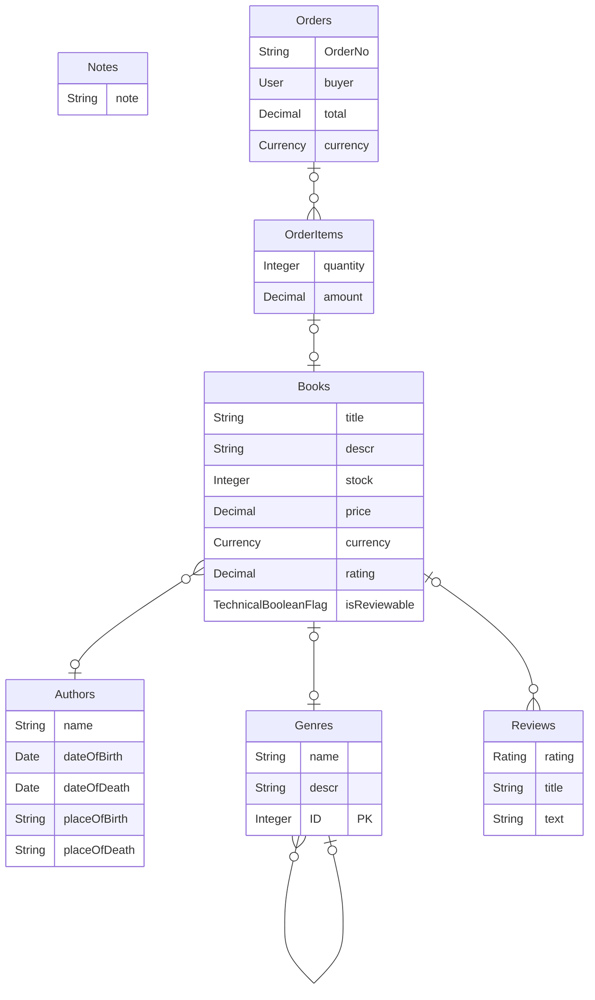

# SAP CDS Entity Relationship Diagrams

The small AWK script generate mermaid Entity Relationship diagrams from SAP Cloud Application Programming Model files.

## How to run

```shell
gawk -f src/cds2erd.awk db/* > bookstore.mermaid
```

## Sample generated ER diagram

